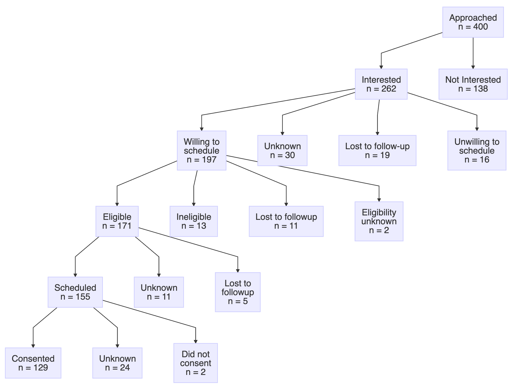

# participantFlowDiagram

<!-- badges: start -->
[](https://doi.org/10.5281/zenodo.15837864)
[](https://github.com/ctsit/participantFlowDiagram/actions/workflows/R-CMD-check.yaml)
<!-- badges: end -->

`participantFlowDiagram` is an R package that helps a study team find issues in the progress of study participants through a research protocol by graphically presenting summary data of their progress.

If you provide it a dataframe of factors that describe each step in the workflows of a study, it can generate graphs like this:



## Installation

You can install the development version of participantFlowDiagram from [GitHub](https://github.com/ctsit/participantFlowDiagram) with:

``` r
# install.packages("pak")
pak::pak("ctsit/participantFlowDiagram")
```

## Example

Here's the most basic example of using `participantFlowDiagram`:

``` r
library(participantFlowDiagram)

consent_tracking_data <- readr::read_csv("vignettes/articles/consent_tracking_data.csv") |>
  dplyr::mutate(dplyr::across(dplyr::everything(), as.factor))

steps <- dplyr::tribble(
  ~parent,                           ~child,
  "Approached",                      "interest",
  "interest_yes",                    "eligibility_scheduling",
  "eligibility_scheduling_willing",  "eligibility",
  "eligibility_yes",                 "consent_scheduling",
  "consent_scheduling_yes",          "consent"
)

pretty_labels <- get_pretty_labels_template(
  participant_level_progress = consent_tracking_data,
  parents = steps$parent,
  children = steps$child
)

create_mermaid_diagram(
  participant_level_progress = consent_tracking_data,
  parents = steps$parent,
  children = steps$child,
  pretty_labels = pretty_labels)
```

For more details, see [Getting Started](https://ctsit.github.io/participantFlowDiagram/articles/Getting-Started.html)
